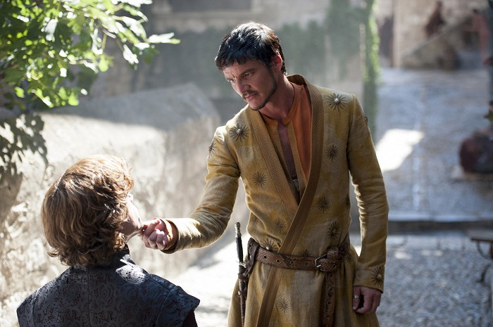

                         
Po dech beroucím závěru třetí řady, zmizelo mnoho ze světa Hra o Trůny, například několik členů rodu Starků. To napomohlo posílení vlivu Lannisterům a však i po této události nemohou být zcela v klidu. Stannis Baratheon posiluje svoji armádu a do Královo Přístaviště přijíždí host na svatbu Joffreyho - Rudá Zmije z Dorne, který svým překvapivým rozhodnutím chce pomoci jinému Lannisterovi v ošemetné situaci. Mezitím Daenerys se svojí velkou armádou Neposkvrněných a podporou tří draků osvobodí otrokářské město Meereen a spřádá plány na přeplutí Úzkého moře. Na severu Noční hlídka čelí velkým nesnázím, které jim přidělává vůdce divokých Mance Rydera, jenž je tak donucen pod hrozbou od Bílých chodců. V sérii se uskuteční několik zajímavých zvratů, jak už jsme od autorů seriálu Hry o Trůny zvyklý.

